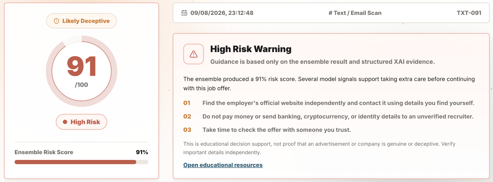
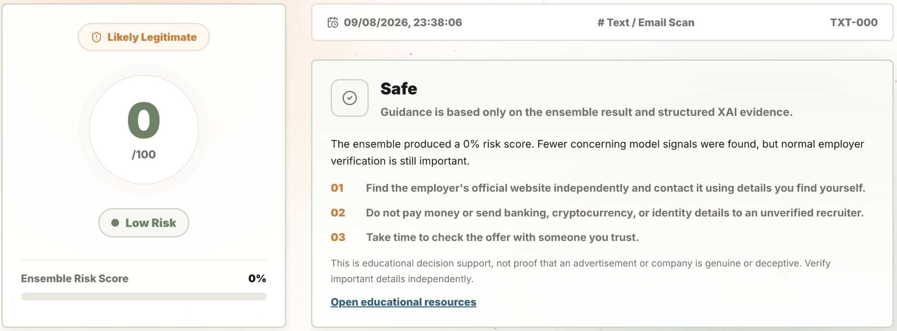
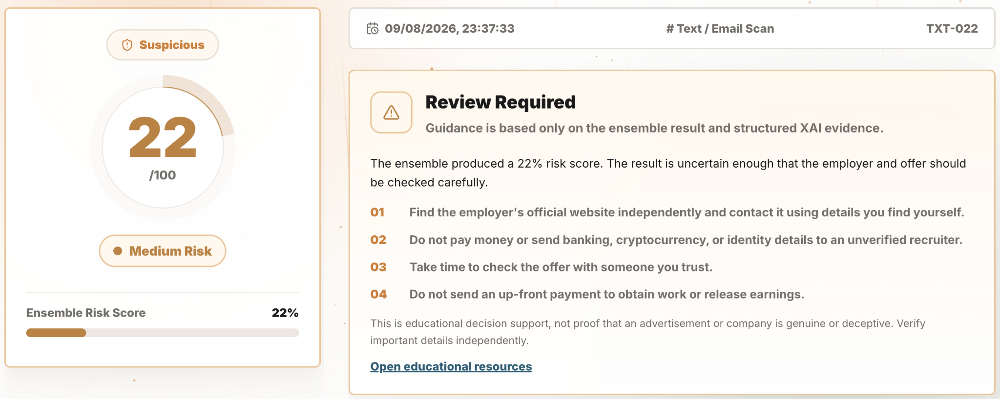
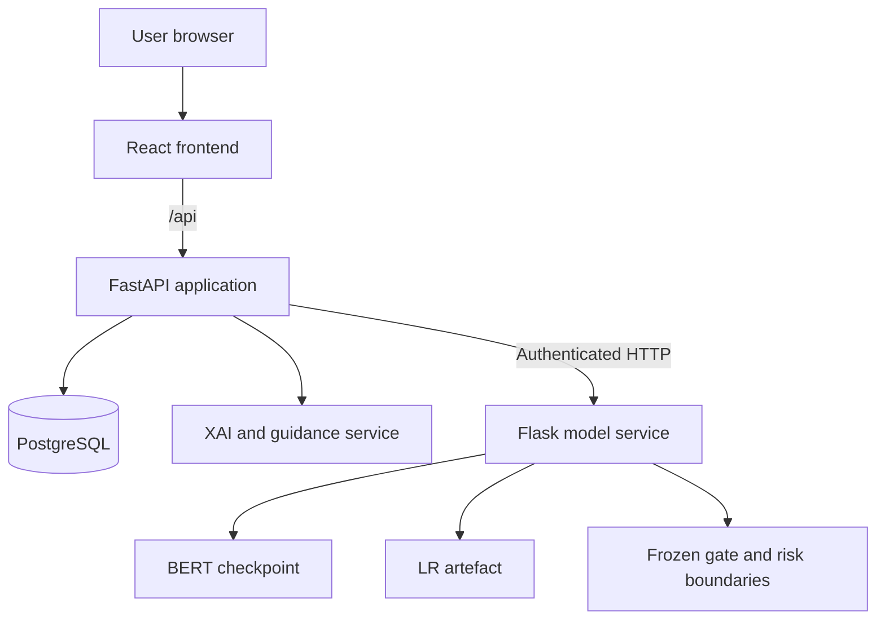

# Fraudulent Job Advertisement Detection Platform

### Explainable fraudulent job advertisement detection with BERT and Logistic Regression

[](https://github.com/XinXie70/recruitment-fraud-detection-platform/actions/workflows/frontend-ci.yml)

**[Live Demo](https://recruitment-fraud.35-253-151-219.sslip.io/login)** ·
**[Model Design](#research-and-model-design)** ·
**[System Architecture](#system-architecture)** ·
**[Run Locally](#run-locally-with-docker)**



*Example high-risk output: the platform combines a 0-100 operational risk score, a
three-level classification, structured XAI evidence, and cautious safety guidance.*

Fraudulent Job Advertisement Detection Platform is a full-stack decision-support platform that helps job seekers assess
potentially deceptive job advertisements. It turns model outputs into a 0–100 operational
risk score, a three-level risk classification, evidence-based explanations, and practical
safety guidance.

This repository contains the final implementation of a **UNSW COMP9900 team project**. It
includes the research pipeline, frozen model artefacts, web application, model service,
database, automated tests, and deployment documentation.

> Fraudulent Job Advertisement Detection Platform provides educational decision support. Its risk score is not a calibrated
> probability of fraud and should not replace independent verification.

## At a glance

| Area | Final outcome |
| --- | --- |
| Problem | Detect deceptive job advertisements from unstructured English text |
| Dataset | EMSCAD: 17,880 job advertisements |
| Final model | BERT-primary classifier with a Logistic Regression false-positive gate |
| User output | Low, Suspicious, or High risk; 0–100 score; XAI evidence; safety guidance |
| Held-out test performance | Fraud F1 **0.9107**, Fraud Precision **0.9387**, Fraud Recall **0.8844** |
| Application | React, FastAPI, Flask model service, PostgreSQL, Docker Compose |

<details>
<summary><strong>View Low and Suspicious output examples</strong></summary>

#### Low-risk output



#### Suspicious output



</details>

## Why this project

Fake job advertisements can closely resemble legitimate opportunities. A binary prediction
alone also gives users little support when the evidence is uncertain. Fraudulent Job Advertisement Detection Platform was built
to combine fraud-detection research with a usable system that:

- identifies potentially deceptive language in a submitted job advertisement;
- separates uncertain cases from clearly low- or high-risk cases;
- explains which text signals influenced the model output;
- gives cautious, actionable guidance without presenting the model as definitive proof; and
- stores privacy-minimised analysis history for authenticated users.

## Product workflow


## Key features

- **Three-level risk classification:** Low, Suspicious, and High avoid forcing uncertain
  advertisements into an overconfident binary answer.
- **BERT–LR decision rule:** BERT supplies the primary fraud signal, while Logistic
  Regression can demote a BERT high-risk candidate when independent evidence is weak.
- **Explainable AI:** SHAP Partition explains the aggregated decision function, with an
  occlusion fallback when required.
- **Gentle AI guidance:** deterministic evidence is converted into cautious educational
  language; optional generative rewriting cannot change the model result.
- **User accounts and history:** JWT authentication, bcrypt password hashing, ownership
  checks, redacted previews, and deletion controls.
- **Admin analytics:** platform activity, risk distribution, service health, and deployed
  model metrics.
- **Defensive API design:** input validation, rate limits, explicit CORS, model-service
  authentication, health checks, and safe error responses.

## Research and model design

The research process compared traditional and Transformer-based text classifiers under a
fixed train/validation/test protocol. Validation data was used for model and threshold
selection; the held-out test set was evaluated once after the configuration was frozen.

The final decision rule is deliberately inspectable:

1. BERT evaluates up to 512 tokens and acts as the primary classifier.
2. If BERT predicts fraud, the LR model checks for an independently weak fraud signal.
3. A validation-selected LR gate can remove a likely BERT false positive.
4. Frozen validation boundaries map the result to Low, Suspicious, or High risk.

The public risk score is an operational ranking signal. It is not presented as a calibrated
fraud probability.

### Held-out test results

The test split contains 3,576 advertisements, including 173 fraudulent examples.

| Model | Fraud Precision | Fraud Recall | Fraud F1 | Macro F1 | PR-AUC |
| --- | ---: | ---: | ---: | ---: | ---: |
| Logistic Regression | 0.9338 | 0.8150 | 0.8704 | 0.9321 | 0.9318 |
| Optimised BERT | 0.9273 | 0.8844 | 0.9053 | 0.9503 | 0.9405 |
| **BERT + LR false-positive gate** | **0.9387** | **0.8844** | **0.9107** | **0.9532** | **0.9478** |

The final gate reduced BERT false positives from 12 to 10 while retaining 153 true fraud
detections. Detailed experiment evidence is available in the
[ensemble results](model_algorithm/sprint3/ensemble_BERT_FP/results/RESULTS.md).

### Three-level evaluation

| Risk level | Test advertisements | Fraudulent | Intended interpretation |
| --- | ---: | ---: | --- |
| Low | 3,291 | 7 | Limited model evidence; normal verification still applies |
| Suspicious | 122 | 13 | Uncertain case requiring closer manual review |
| High | 163 | 153 | Strong model evidence; proceed with extra caution |

Overall, 166 of 173 known fraudulent test advertisements were kept outside the Low category.
See the [frozen risk configuration](model_service/models/risk/risk_boundary_config.json) for
the validation-selected rules.

## System architecture



The business application remains a modular FastAPI service, while compute-heavy inference is
isolated behind a model API. This keeps authentication, persistence, and user workflows
separate from model artefacts and inference dependencies. The full rationale is documented in
[Design Justification](docs/design-justification.md) and the
[architecture records](docs/architecture/README.md).

## Technology stack

| Layer | Technologies |
| --- | --- |
| Frontend | React, Vite, React Router, ECharts |
| Application API | FastAPI, SQLAlchemy, Alembic, JWT, bcrypt |
| Model service | Flask, PyTorch, Transformers, scikit-learn, SHAP |
| Data | PostgreSQL, EMSCAD |
| Delivery | Docker, Docker Compose, Nginx/Cloud deployment configurations |
| Quality | pytest, Vitest, Playwright, Ruff, ESLint |

## My contribution — Xin Xie

This was a team project. My model-research and evaluation contributions, preserved in the Git
history, focused on:

- establishing the shared preprocessing pipeline and fixed train/validation/test splits;
- investigating duplicate leakage through random, deduplicated, and group-aware experiments;
- implementing and evaluating Logistic Regression and calibrated Linear SVM baselines;
- running paper-aligned LR comparisons and BERT–LR ensemble experiments;
- implementing validation-selected three-level risk boundaries; and
- developing the gate-adjusted operational risk score and its evaluation reports.

See the repository [contributors](https://github.com/XinXie70/recruitment-fraud-detection-platform/graphs/contributors)
and commit history for the complete team contribution record.

## Quality assurance

| Area | Verified coverage |
| --- | ---: |
| Backend | 92.16% |
| Model service | 95.71% |
| Frontend statements | 88.96% |

The verified baseline contains 185 passing Python tests and 65 passing frontend tests across
unit, integration, browser-flow, concurrency, failure-handling, and opt-in real-model layers.
Testing details and commands are retained in the
[original technical README](docs/archive/README-technical-original.md).

## Run locally with Docker

### Requirements

- Docker Desktop with Docker Compose v2
- Git and Git LFS
- At least 8 GB RAM and 10 GB free disk space

### Start the application

```bash
git lfs install
git clone https://github.com/XinXie70/recruitment-fraud-detection-platform.git
cd recruitment-fraud-detection-platform
git lfs pull
docker compose up --build -d
```

Open [http://localhost:5190/login](http://localhost:5190/login). The first build can take
10–30 minutes, followed by additional CPU model warm-up time.

Check the services with `docker compose ps -a`. Stop the application without deleting saved
data using `docker compose down`.

> Do not use `docker compose down -v` unless you intend to permanently delete local accounts
> and analysis history.

## Documentation

- [Original technical README](docs/archive/README-technical-original.md)
- [Development guide](docs/development-guide.md)
- [Architecture documentation](docs/architecture/README.md)
- [Design justification](docs/design-justification.md)
- [Data contract](DATA_CONTRACT_V1.md)
- [Model experiment contract](MODEL_EXPERIMENT_CONTRACT_V1.md)
- [Model-service testing strategy](model_service/tests/README.md)

## Current limitations

- Performance has primarily been evaluated on EMSCAD, so generalisation to newer job markets,
  languages, and AI-generated advertisements requires further study.
- Risk scores rank model concern but are not calibrated fraud probabilities.
- XAI describes model behaviour and should not be interpreted as causal evidence of fraud.
- CPU inference and perturbation-based explanations can introduce noticeable latency.
- A formal user study is still required to validate interpretation of risk levels and guidance.

## Project attribution

Fraudulent Job Advertisement Detection Platform was developed as a UNSW COMP9900 capstone team project. All original contributor
names and commits have been retained in this public repository. This portfolio section
highlights Xin Xie's work without claiming sole authorship of the system.
