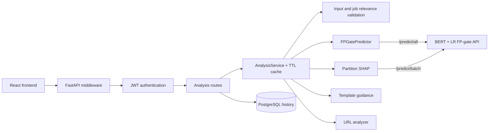

# Backend component diagram

```mermaid
flowchart LR
    ui["React frontend"] --> middleware["FastAPI middleware"]
    middleware --> auth["JWT authentication"]
    auth --> analysis["Analysis routes"]
    analysis --> service["AnalysisService + TTL cache"]
    service --> validator["Input and job relevance validation"]
    service --> predictor["FPGatePredictor"]
    predictor -->|"/predict/all"| model["BERT + LR FP-gate API"]
    service --> xai["Partition SHAP"]
    xai -->|"/predict/batch"| model
    service --> gentle["Template guidance"]
    service --> url["URL analyzer"]
    analysis --> db[("PostgreSQL history")]
```

FastAPI owns HTTP, authentication, workflow, explanation, and persistence.
The model API exclusively owns model loading and FP-gate decisions.
