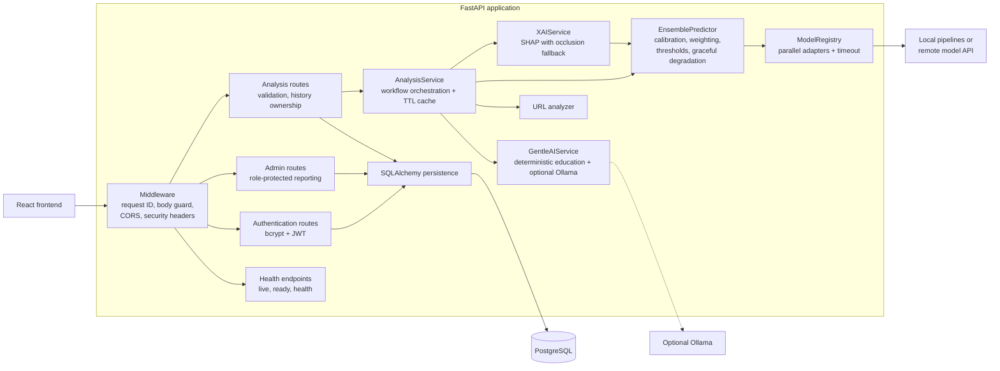

# Backend component diagram

The dependency direction keeps HTTP concerns in routers and business logic in
services. `ModelRegistry` hides whether inference is local or remote, allowing
deployment changes without changing the analysis route contract.
