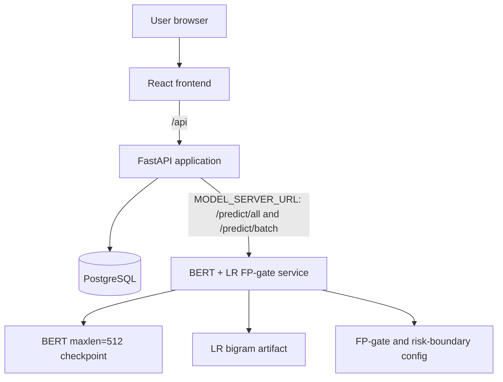

# Deployment diagram

The local Compose stack starts PostgreSQL, migrations, the model API, FastAPI,
and then the frontend in dependency order. The production GitHub Actions
workflow currently runs the backend migration/deployment job and the frontend
deployment job in parallel, so it does not enforce that same ordering.
`MODEL_SERVER_URL` is mandatory. Model service failure is surfaced as `503`;
there is no local model fallback.

## Production ownership

The repository's Cloud Run workflow deploys the application backend and
frontend. The FP-gate model service is a separately operated dependency because
its model artifacts and accelerator requirements have a different release
lifecycle. A production release is not complete until the model-service owner
has deployed a compatible version and provided its HTTPS endpoint.

Before deploying FastAPI:

1. Verify the model service's `GET /health` endpoint reports ready.
2. Verify authenticated `POST /predict/all` and `POST /predict/batch` requests
   satisfy the contract documented in the root README.
3. Configure `MODEL_SERVER_URL` with the HTTPS endpoint and load
   `MODEL_SERVER_API_KEY` from the deployment secret store.
4. Keep the previous model-service revision available until an application
   smoke test succeeds, so the release can be rolled back independently.

The application deployment workflow intentionally does not build or deploy the
model image. If ownership moves into this repository, add a dedicated model
job with explicit CPU/GPU, artifact-storage, secret, readiness, and rollback
configuration rather than treating it as part of the lightweight backend image.
