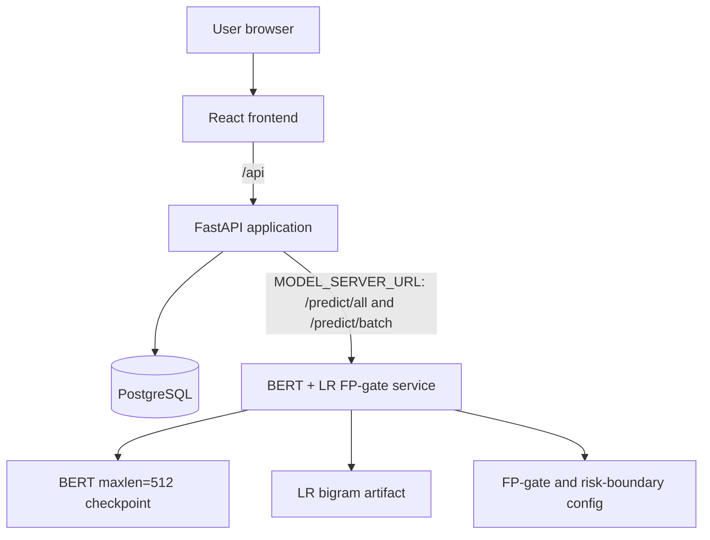

# Deployment diagram

Startup order is PostgreSQL, migrations, model API, FastAPI, then frontend.
`MODEL_SERVER_URL` is mandatory. Model service failure is surfaced as `503`;
there is no local model fallback.
