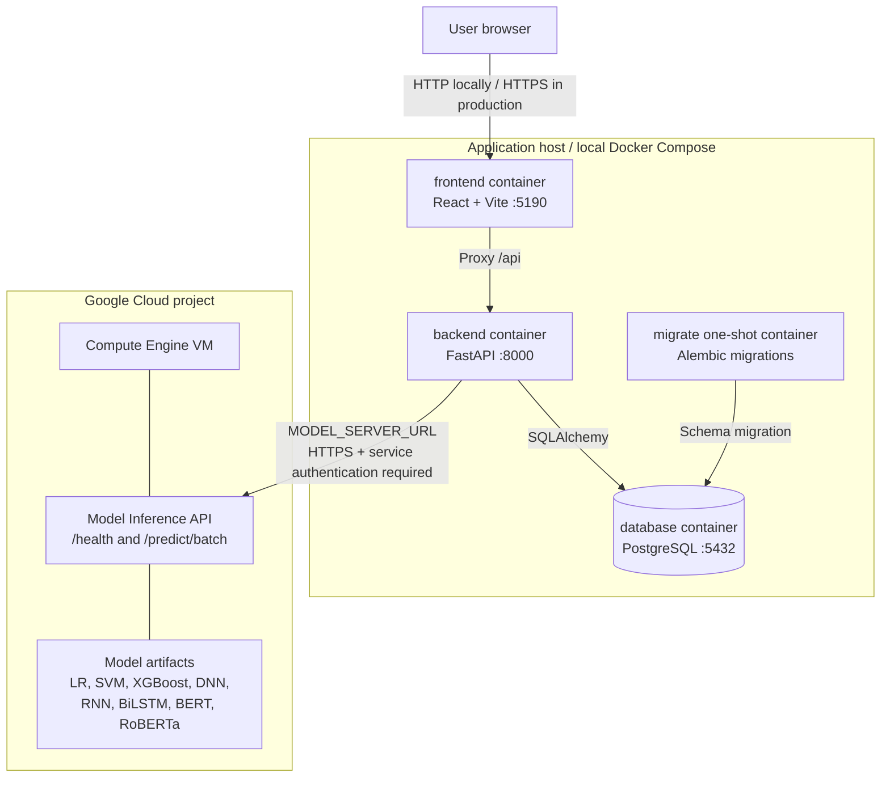

# Deployment diagram

The checked-in Compose configuration provides a reproducible local deployment.
The model inference workload can run remotely because its model artifacts and
compute requirements differ from the business API.

## Startup order

`database healthy` → `migrations completed` → `backend healthy` → `frontend`

Docker Compose encodes this order using health checks and `depends_on`. The
remote model service is configured using `MODEL_SERVER_URL`; when it is unset,
the backend can load local model adapters instead.
