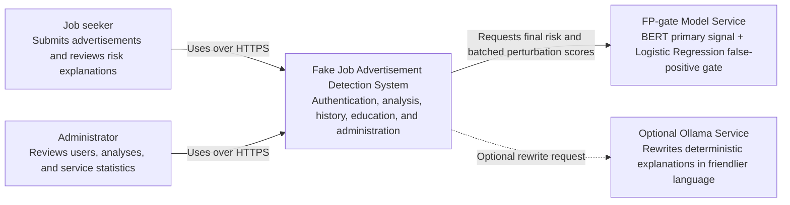

# System context

This diagram shows the people and external systems that interact with the Fake
Job Advertisement Detection System.

## Boundary and trust assumptions

- Browsers communicate with the application API; they do not call the model
  server directly.
- Authentication and authorization are enforced by the FastAPI backend.
- Ollama is optional. The application retains deterministic template-based
  explanations when it is unavailable.
- Production traffic to both application and model endpoints should use HTTPS.
  The model endpoint should additionally require service-to-service
  authentication and network restrictions.
