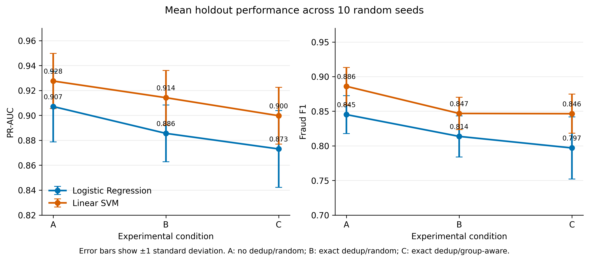
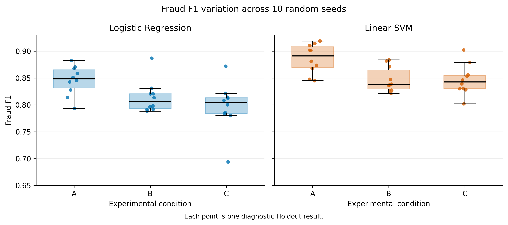
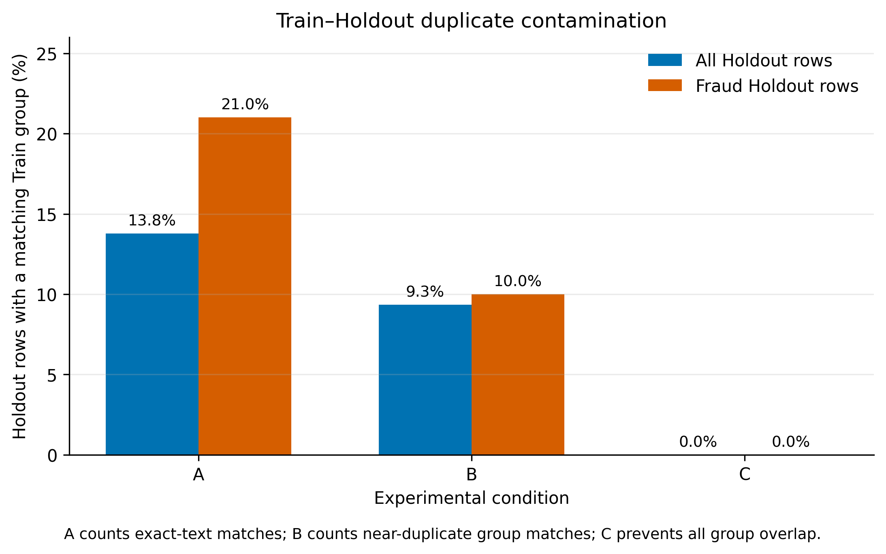

# Duplicate Handling and Split Strategy Experiment

## 1. Research question

This experiment investigates the following question:

> To what extent do exact duplicates and near-duplicate group overlap affect the measured performance of fake job advertisement classifiers on EMSCAD?

The experiment is intended to evaluate leakage risk in our own workflow. It does not prove that any previous study contained data leakage unless that study's splitting procedure is independently reproduced.

## 2. Experimental design

Three conditions were evaluated:

| Condition | Input data | Outer split | Purpose |
|---|---|---|---|
| A | Original 17,880 rows | Ordinary stratified random split | Represents a simple workflow that retains exact duplicates |
| B | 15,807 rows after exact deduplication | Ordinary stratified random split, ignoring `group_id` | Measures the effect of exact deduplication |
| C | Same 15,807 rows as B | Group-aware split using complete `group_id` units | Measures the effect of controlling near-duplicate overlap |

Each condition used a 70/15/15 diagnostic Train/Validation/Holdout allocation and ten random seeds (0–9). The official project Test set was not accessed. Thresholds were selected independently on each diagnostic Validation partition by maximising fraudulent-class F1 and were then applied once to the corresponding diagnostic Holdout.

The same fixed TF-IDF settings and classifier hyperparameters were used across conditions. The evaluated classifiers were Logistic Regression and Linear SVM. Linear SVM used Train-only sigmoid calibration. In Condition C, its internal calibration folds were also group-aware, so the SVM B-to-C comparison represents the complete strict workflow rather than only the outer split change.

## 3. Evaluation measures

PR-AUC is treated as the primary ranking metric because fraudulent advertisements form the minority class. Fraudulent-class precision, recall and F1 describe performance on the positive class. Macro F1 gives equal importance to both labels, while ROC-AUC is included for comparison with previous work.

Results are reported as the mean and standard deviation across ten random seeds. The standard deviation describes sensitivity to the data allocation; it should not be interpreted as a confidence interval for performance on all possible job advertisements.

## 4. Results

### 4.1 Performance across experimental conditions

| Model | Condition | PR-AUC | Fraud precision | Fraud recall | Fraud F1 | Macro F1 |
|---|---|---:|---:|---:|---:|---:|
| Logistic Regression | A | 0.9071 ± 0.0283 | 0.9285 ± 0.0334 | 0.7777 ± 0.0483 | 0.8452 ± 0.0273 | 0.9190 ± 0.0142 |
| Logistic Regression | B | 0.8856 ± 0.0228 | 0.8886 ± 0.0579 | 0.7551 ± 0.0569 | 0.8137 ± 0.0297 | 0.9028 ± 0.0154 |
| Logistic Regression | C | 0.8731 ± 0.0308 | 0.8527 ± 0.0965 | 0.7548 ± 0.0475 | 0.7970 ± 0.0449 | 0.8939 ± 0.0237 |
| Linear SVM | A | 0.9276 ± 0.0222 | 0.9411 ± 0.0283 | 0.8392 ± 0.0522 | 0.8860 ± 0.0271 | 0.9403 ± 0.0141 |
| Linear SVM | B | 0.9142 ± 0.0219 | 0.9153 ± 0.0428 | 0.7916 ± 0.0550 | 0.8468 ± 0.0233 | 0.9200 ± 0.0121 |
| Linear SVM | C | 0.8997 ± 0.0228 | 0.8840 ± 0.0442 | 0.8129 ± 0.0264 | 0.8464 ± 0.0282 | 0.9197 ± 0.0148 |

**Figure 1.** Mean diagnostic Holdout PR-AUC and fraudulent-class F1 across ten seeds. Error bars show one standard deviation.

Removing exact duplicates from A to B reduced fraudulent-class F1 by 0.0315 for Logistic Regression and 0.0392 for Linear SVM. PR-AUC decreased by 0.0215 and 0.0134, respectively. This consistent reduction indicates that retaining exact duplicates can produce more favourable performance estimates under ordinary random splitting.

Changing from the random split in B to the group-aware workflow in C reduced Logistic Regression PR-AUC by a further 0.0125 and fraudulent-class F1 by 0.0167. For Linear SVM, PR-AUC decreased by 0.0145, whereas fraudulent-class F1 remained almost unchanged (-0.0004). Its lower precision and higher recall in C largely offset one another in the F1 calculation. Consequently, the effect of group-aware evaluation depends on both the model and the selected metric.

### 4.2 Sensitivity to the random seed

**Figure 2.** Distribution of fraudulent-class F1 over ten random seeds. Each point represents one diagnostic Holdout allocation.

Logistic Regression was more sensitive to group-aware allocation: its Fraud F1 standard deviation increased from 0.0297 in B to 0.0449 in C. Linear SVM was more stable, with corresponding standard deviations of 0.0233 and 0.0282. The increased variation in C is plausible because entire fraud groups, rather than individual rows, are moved between partitions.

### 4.3 Duplicate contamination

**Figure 3.** Mean percentage of diagnostic Holdout rows with an exact or group-level match in diagnostic Train. The matching definition differs between A and B and is stated in the figure.

In Condition A, an average of 13.8% of all Holdout rows and 21.0% of fraudulent Holdout rows had an exact-text match in Train. Exact duplicates were absent in Condition B, but 9.3% of Holdout rows and 10.0% of fraudulent Holdout rows still belonged to a near-duplicate group represented in Train. Condition C reduced group overlap to zero for every seed.

## 5. Discussion

The largest decrease in fraudulent-class F1 occurred after exact deduplication rather than after group-aware splitting. This suggests that exact duplicates are an important source of optimistic evaluation in this dataset. However, near-duplicate control still reduced PR-AUC for both classifiers and reduced Logistic Regression F1.

The SVM result demonstrates why leakage analysis should not rely on one metric. Its B-to-C F1 difference was negligible, but PR-AUC and precision decreased while recall increased. Reporting only F1 would therefore hide a change in score ranking and the precision–recall trade-off.

These findings support the use of exact deduplication and group-aware splitting in the shared workflow. They also offer a plausible explanation for performance gaps between this project and studies using ordinary random splits. Nevertheless, they do not establish that another paper used a leaking split. Such a claim would require access to, or reproduction of, the paper's exact data preparation and evaluation procedure.

## 6. Threats to validity

- Conditions were evaluated only on EMSCAD and may not generalise to newer or external job advertisements.
- Ten seeds describe split sensitivity but do not make the Holdout results independent observations.
- Near-duplicate groups depend on the current similarity rule; grouping errors may either miss related advertisements or combine genuinely different advertisements.
- Condition A and Condition B use different numbers of rows and fraudulent examples because exact duplicates are removed in B. Their difference is therefore the practical effect of deduplication, not a pure estimate of memorisation alone.
- For Linear SVM, Condition C also uses group-aware internal calibration. Its B-to-C difference measures the full strict workflow, whereas the Logistic Regression comparison isolates the outer split more directly.
- Validation-selected thresholds make F1 dependent on the sampled Validation partition. PR-AUC is threshold-independent and should remain the primary comparison metric.
- No external dataset was used in this experiment, so cross-domain generalisation was not tested.

## 7. Recommended paper placement

### Methods

Include Sections 2 and 3, together with the condition table. Describe this as a controlled sensitivity analysis separate from the final fixed-split model evaluation.

### Results

Include Table 1 and Figures 1–3. Report both the mean and standard deviation across seeds. Emphasise PR-AUC and fraudulent-class F1 rather than accuracy.

### Discussion

Use the interpretation in Section 5, keeping the distinction between evidence of leakage risk in our experiment and proof of leakage in previous work.

### Appendix or supplementary material

Provide the per-seed CSV files, exact split algorithms, model configurations and dataset hashes so the experiment can be reproduced.
